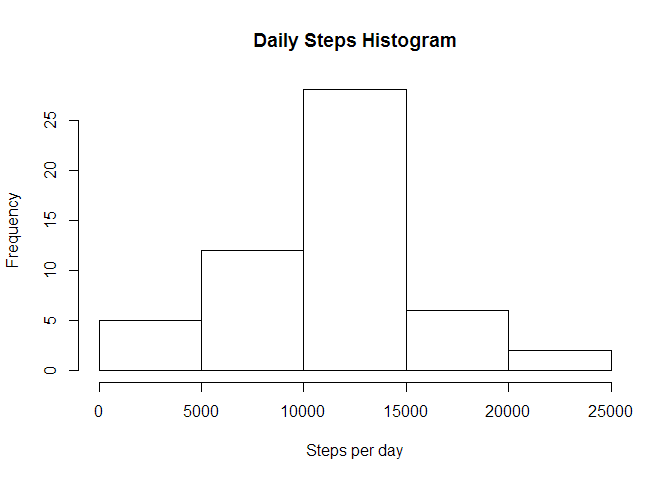
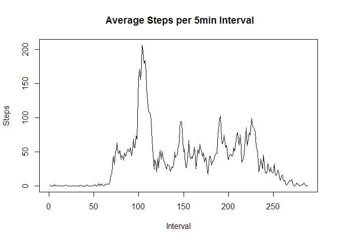
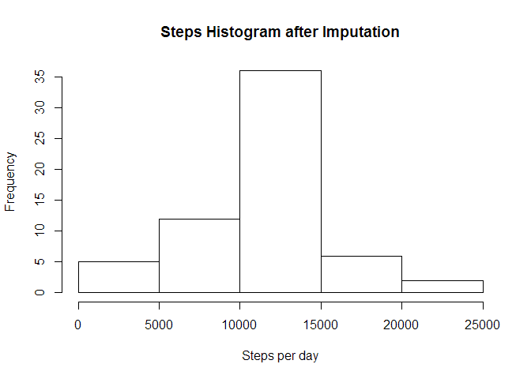
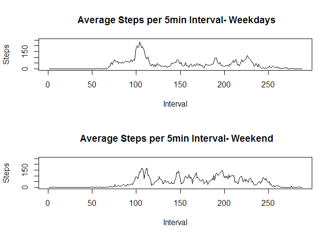

# Reproducible Research: Peer Assessment 1


## Loading and preprocessing the data

Loaded the activity data from the project directory into data-frame called mydata  
Created subset mydata1 with no missing values using the following code  


```r
mydata <- read.csv("activity.csv", header=TRUE, sep=",")
mydata1 <- mydata[complete.cases(mydata),]
summary(mydata1)
```

```
##      steps                date          interval     
##  Min.   :  0.00   2012-10-02:  288   Min.   :   0.0  
##  1st Qu.:  0.00   2012-10-03:  288   1st Qu.: 588.8  
##  Median :  0.00   2012-10-04:  288   Median :1177.5  
##  Mean   : 37.38   2012-10-05:  288   Mean   :1177.5  
##  3rd Qu.: 12.00   2012-10-06:  288   3rd Qu.:1766.2  
##  Max.   :806.00   2012-10-07:  288   Max.   :2355.0  
##                   (Other)   :13536
```

## What is mean total number of steps taken per day?
Aggregate the steps per day and plot a histogram of steps taken per day   


```r
# Derive a vector mydata2 with sum of steps for each date
mydata2 <- tapply(mydata1$steps, mydata1$date, sum)

hist(mydata2, xlab= "Steps per day", main="Daily Steps Histogram")
```

 

Mean steps per day is: 1.0766189\times 10^{4}  
Median steps per day is: 10765  

## What is the average daily activity pattern?
Derive Mean steps per 5 minute interval and plot as time series 


```r
mydata3 <- tapply(mydata1$steps, mydata1$interval, mean)


plot(mydata3, type="l", main=" Average Steps per 5min Interval", ylab="Steps", xlab="Interval")
```

 

```r
# m1 <- max(mydata3)
# m1
m2 <- which.max(mydata3)
hh <- as.integer((m2-1)/12)
mm <- ((m2-1) - hh*12)*5
```

It can be seen that the maximum steps per interval is 'r max(mydata3)`.
This occurs in the interval commencing at 8 hour, 35 minutes. 


## Imputing missing values

The missing values of steps for any interval will be replaced by the average value of steps for that interval on other days.

The following code adds variables hh (hours), mint (minutes) and int (interval number) to the initial mydata data-frame. It then adds the mst variable (mean steps per interval). Then stepsx variable is added which is mst when there is a missing value for steps. 

```r
# Now deal with missing values
misr <- complete.cases(mydata)

# Add mean steps per interval as an additional column mst of the mydata dataframe
mydata$hh <-  as.integer(mydata$interval/100)
mydata$mint <-  as.integer((mydata$interval - mydata$hh*100)/5)
mydata$int <- (mydata$hh*12) + (mydata$mint + 1) 
# Look-up in mydata3 vector
mydata$mst <- mydata3[mydata$int]
mydata$stepsx <- ifelse(misr, mydata$steps, mydata$mst)
```

The following histogram shows the distribution of steps per day after imputation

```r
mydx <- tapply(mydata$stepsx, mydata$date, sum)
hist(mydx, xlab= "Steps per day", main="Steps Histogram after Imputation")
```

 

Mean steps per day using imputation is: 1.0766189\times 10^{4}  
Median steps using imputation per day is: 1.0766189\times 10^{4}  

So the impact of imputation on the mean is negligible

## Are there differences in activity patterns between weekdays and weekends?

To analyze the differences between weekend and weekday activity patterns, we add a character day variable and a logical weekend variable to the mydata dataframe 


```r
mydata$day <- weekdays(as.Date(mydata$date))
mydata$weekend <- ifelse((mydata$day=="Sunday") | (mydata$day == "Saturday"), TRUE, FALSE)
summary(mydata)
```

```
##      steps                date          interval            hh       
##  Min.   :  0.00   2012-10-01:  288   Min.   :   0.0   Min.   : 0.00  
##  1st Qu.:  0.00   2012-10-02:  288   1st Qu.: 588.8   1st Qu.: 5.75  
##  Median :  0.00   2012-10-03:  288   Median :1177.5   Median :11.50  
##  Mean   : 37.38   2012-10-04:  288   Mean   :1177.5   Mean   :11.50  
##  3rd Qu.: 12.00   2012-10-05:  288   3rd Qu.:1766.2   3rd Qu.:17.25  
##  Max.   :806.00   2012-10-06:  288   Max.   :2355.0   Max.   :23.00  
##  NA's   :2304     (Other)   :15840                                   
##       mint            int              mst              stepsx      
##  Min.   : 0.00   Min.   :  1.00   Min.   :  0.000   Min.   :  0.00  
##  1st Qu.: 2.75   1st Qu.: 72.75   1st Qu.:  2.486   1st Qu.:  0.00  
##  Median : 5.50   Median :144.50   Median : 34.113   Median :  0.00  
##  Mean   : 5.50   Mean   :144.50   Mean   : 37.383   Mean   : 37.38  
##  3rd Qu.: 8.25   3rd Qu.:216.25   3rd Qu.: 52.835   3rd Qu.: 27.00  
##  Max.   :11.00   Max.   :288.00   Max.   :206.170   Max.   :806.00  
##                                                                     
##      day             weekend       
##  Length:17568       Mode :logical  
##  Class :character   FALSE:12960    
##  Mode  :character   TRUE :4608     
##                     NA's :0        
##                                    
##                                    
## 
```

This supports display of activity time series for weekdays and weekends separately


```r
par(mfrow=c(2,1))

mydworkd <- mydata[!mydata$weekend, ]
mydata3 <- tapply(mydworkd$stepsx, mydworkd$interval, mean)
plot(mydata3, type="l", main=" Average Steps per 5min Interval- Weekdays", ylab="Steps", xlab="Interval", ylim= c(0,250))

mydwend <- mydata[mydata$weekend,]
mydata4 <- tapply(mydwend$stepsx, mydwend$interval, mean)
plot(mydata4, type="l", main=" Average Steps per 5min Interval- Weekend", ylab="Steps", xlab="Interval", ylim= c(0,250))
```

 

It can be seen that on the weekends, the morn peak is a little later than on weekdays. There are more steps per interval during the most of the rest of the day.
